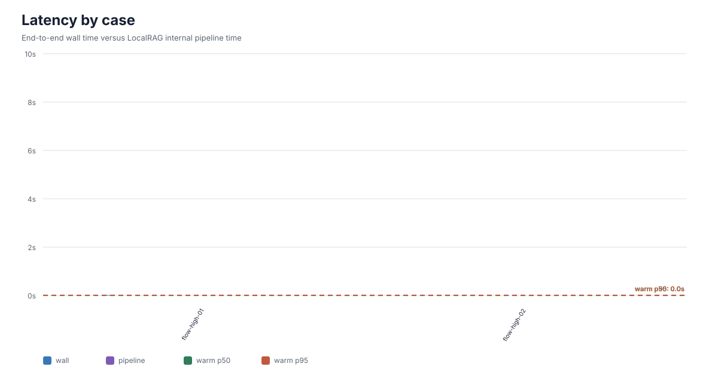
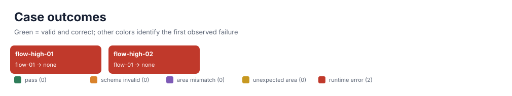

# LLM Evaluation Report

Generated: `2026-08-13T07:21:21.359164Z`
Model: `Qwen3-8B-Q4_K_M`
Package/job: `72ebb6668052`

## Summary

- Schema validity: **0/2 (0%)**
- Selected entity accuracy: **0/2 (0%)**
- Unexpected area selections on no-area cases: **0**
- Cold-start end-to-end latency: **20.581 ms**
- Warm end-to-end latency p50: **4.138 ms**
- Warm end-to-end latency p95: **4.138 ms**
- Internal pipeline latency p50/p95: **n/a / n/a**

## Visualizations

- [Open HTML report](report.html)

## Per-case Results

| caseId | expectedArea | actualArea | schema | wallMs | pipelineMs | status |
|---|---|---|---:|---:|---:|---|
| flow-high-01 | flow-01 | none | no | 20.581 | n/a | error |
| flow-high-02 | flow-01 | none | no | 4.138 | n/a | error |

## Failures and Diagnostics

- `flow-high-01`: schema=runtime_error; entity_expected='flow-01',entity_actual=None; error=RuntimeError: Qwen3-8B gagal dimuat oleh llama.cpp: No module named 'llama_cpp'
- `flow-high-02`: schema=runtime_error; entity_expected='flow-01',entity_actual=None; error=RuntimeError: Qwen3-8B gagal dimuat oleh llama.cpp: No module named 'llama_cpp'
