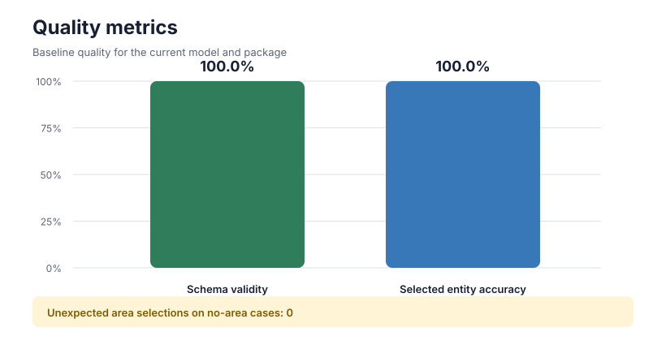
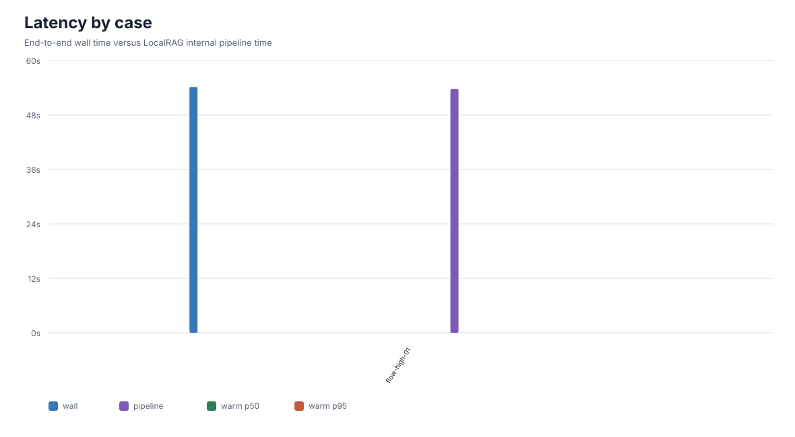

# LLM Evaluation Report

Generated: `2026-08-13T07:26:31.992974Z`
Model: `Qwen3-8B-Q4_K_M`
Package/job: `72ebb6668052`

## Summary

- Schema validity: **1/1 (100.000%)**
- Selected entity accuracy: **1/1 (100.000%)**
- Unexpected area selections on no-area cases: **0**
- Cold-start end-to-end latency: **54158.298 ms**
- Warm end-to-end latency p50: **n/a**
- Warm end-to-end latency p95: **n/a**
- Internal pipeline latency p50/p95: **n/a / n/a**

## Visualizations

- [Open HTML report](report.html)

## Per-case Results

| caseId | expectedArea | actualArea | schema | wallMs | pipelineMs | status |
|---|---|---|---:|---:|---:|---|
| flow-high-01 | flow-01 | flow-01 | yes | 54158.298 | 53753.395 | ok |
