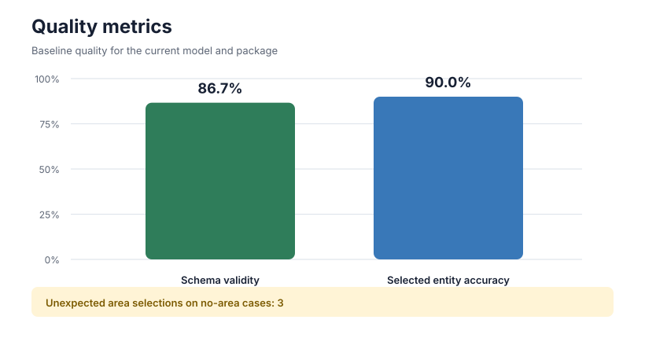
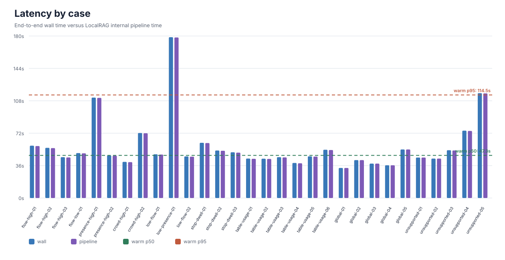
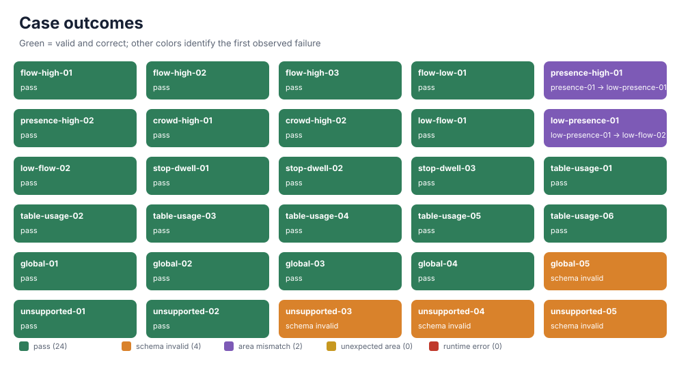

# LLM Evaluation Report

Generated: `2026-08-13T07:56:06.768314Z`
Model: `Qwen3-8B-Q4_K_M`
Package/job: `72ebb6668052`

## Summary

- Schema validity: **26/30 (86.667%)**
- Selected entity accuracy: **18/20 (90.000%)**
- Unexpected area selections on no-area cases: **3**
- Cold-start end-to-end latency: **58121.602 ms**
- Warm end-to-end latency p50: **47345.775 ms**
- Warm end-to-end latency p95: **114492.467 ms**
- Internal pipeline latency p50/p95: **47025.881 ms / 114220.396 ms**

## Visualizations

- [Open HTML report](report.html)

## Per-case Results

| caseId | expectedArea | actualArea | schema | wallMs | pipelineMs | status |
|---|---|---|---:|---:|---:|---|
| flow-high-01 | flow-01 | flow-01 | yes | 58121.602 | 57726.675 | ok |
| flow-high-02 | flow-01 | flow-01 | yes | 55748.632 | 55449.912 | ok |
| flow-high-03 | flow-01 | flow-01 | yes | 45369.351 | 45073.460 | ok |
| flow-low-01 | flow-05 | flow-05 | yes | 49906.864 | 49617.663 | ok |
| presence-high-01 | presence-01 | low-presence-01 | yes | 111553.536 | 111249.532 | ok |
| presence-high-02 | presence-01 | presence-01 | yes | 47345.775 | 47025.881 | ok |
| crowd-high-01 | crowd-02 | crowd-02 | yes | 40142.071 | 39850.548 | ok |
| crowd-high-02 | crowd-01 | crowd-01 | yes | 72222.915 | 71927.292 | ok |
| low-flow-01 | low-flow-01 | low-flow-01 | yes | 48570.098 | 48278.051 | ok |
| low-presence-01 | low-presence-01 | low-flow-02 | yes | 178664.044 | 178378.540 | ok |
| low-flow-02 | low-flow-02 | low-flow-02 | yes | 46194.892 | 45907.268 | ok |
| stop-dwell-01 | stop-cluster-01 | stop-cluster-01 | yes | 61346.247 | 61073.844 | ok |
| stop-dwell-02 | stop-cluster-01 | stop-cluster-01 | yes | 52758.402 | 52477.064 | ok |
| stop-dwell-03 | stop-cluster-12 | stop-cluster-12 | yes | 50820.689 | 50413.033 | ok |
| table-usage-01 | table-02 | table-02 | yes | 43832.277 | 43545.632 | ok |
| table-usage-02 | table-02 | table-02 | yes | 43660.283 | 43398.834 | ok |
| table-usage-03 | table-03 | table-03 | yes | 45369.384 | 45089.750 | ok |
| table-usage-04 | table-03 | table-03 | yes | 38937.871 | 38584.250 | ok |
| table-usage-05 | table-05 | table-05 | yes | 46280.671 | 46016.100 | ok |
| table-usage-06 | table-03 | table-03 | yes | 53607.725 | 53307.787 | ok |
| global-01 | none | none | yes | 33379.419 | 33374.603 | ok |
| global-02 | none | none | yes | 42109.824 | 42102.763 | ok |
| global-03 | none | none | yes | 38219.110 | 38209.228 | ok |
| global-04 | none | none | yes | 36362.094 | 36357.248 | ok |
| global-05 | none | none | no | 53916.424 | 53911.235 | invalid_schema |
| unsupported-01 | none | none | yes | 44959.607 | 44955.466 | ok |
| unsupported-02 | none | none | yes | 43796.196 | 43789.792 | ok |
| unsupported-03 | none | table-01 | no | 53087.376 | 52803.474 | invalid_schema |
| unsupported-04 | none | crowd-01 | no | 74813.361 | 74514.999 | invalid_schema |
| unsupported-05 | none | presence-02 | no | 116451.755 | 116200.971 | invalid_schema |

## Failures and Diagnostics

- `presence-high-01`: entity_expected='presence-01',entity_actual='low-presence-01'
- `low-presence-01`: entity_expected='low-presence-01',entity_actual='low-flow-02'
- `global-05`: schema=areaMarkerInvalid
- `unsupported-03`: schema=selectedArea_unexpected
- `unsupported-04`: schema=selectedArea_unexpected
- `unsupported-05`: schema=selectedArea_unexpected
